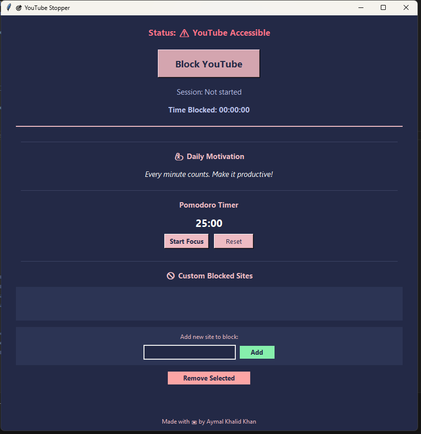

# 🚫 YouTube & Website Blocker – Focus App for Productivity

Block YouTube and distracting sites system-wide with one click. Includes a motivation widget and Pomodoro timer. Boost your focus and reclaim your time!

> **Quick Start:**  
> Download and run `YouTubeStopper.exe` — no setup required!

---

## ✨ Features
- Block YouTube and any custom sites system-wide
- Motivation widget with rotating quotes
- Built-in Pomodoro timer (25 min focus)
- Safe: automatic backup/restore of system files
- Works on Windows (EXE) and Python (cross-platform)

## ⚙️ How It Works
Modifies your system hosts file to block selected domains (admin rights required). Blocking is persistent until you unblock.

## 🛠️ Customization
- Add/remove blocked sites from the app UI
- Edit motivational messages or timer in the code for advanced tweaks

## 🏗️ Build & Development
- For Windows: just run `YouTubeStopper.exe`
- For Python: `pip install -r requirements.txt && python app.py`
- To build your own EXE: `python build_exe.py`

## 📋 Requirements
- Windows 10/11 (EXE) or Python 3.8+ (cross-platform)
- Admin rights to block/unblock sites

## 📜 License
Non-commercial use only. See LICENSE for details.

## 🤝 Contributing
Pull requests and suggestions welcome!
